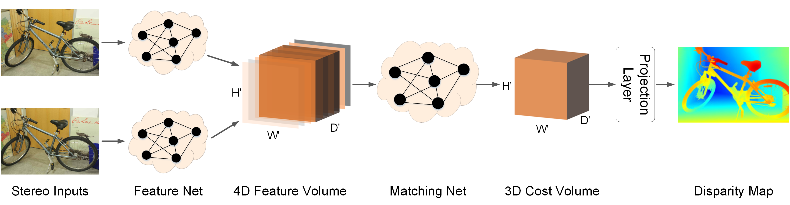

## LEAStereo

This repository contains the code for our NeurIPS 2020 paper `Hierarchical Neural Architecture Searchfor Deep Stereo Matching` [[NeurIPS 20]()] [[arxiv](https://arxiv.org/abs/2010.13501)] 



The implementation of our architecture search part is partly borrowed from [[AutoDeeplab](https://openaccess.thecvf.com/content_CVPR_2019/html/Liu_Auto-DeepLab_Hierarchical_Neural_Architecture_Search_for_Semantic_Image_Segmentation_CVPR_2019_paper.html)]  [[pytorch code](https://github.com/NoamRosenberg/autodeeplab)(Non-official)]. 

### Citing
If you find this code useful, please consider to cite our work.

```
@misc{cheng2020hierarchical,
      title={Hierarchical Neural Architecture Search for Deep Stereo Matching}, 
      author={Xuelian Cheng and Yiran Zhong and Mehrtash Harandi and Yuchao Dai and Xiaojun Chang and Tom Drummond and Hongdong Li and Zongyuan Ge},
      year={2020},
      eprint={2010.13501},
      archivePrefix={arXiv},
      primaryClass={cs.CV}
}
```

## Requirements

### Environment

1. Python 3.8.*
2. CUDA 10.0
3. PyTorch 
4. TorchVision 

### Install
Create a  virtual environment and activate it.
```shell
conda create -n leastereo python=3.8
conda activate leastereo
```
The code has been tested with PyTorch 1.6 and Cuda 10.2.
```shell
conda install pytorch=1.6.0 torchvision=0.7.0 cudatoolkit=10.2 -c pytorch
conda install matplotlib path.py tqdm
conda install tensorboard tensorboardX
conda install scipy scikit-image opencv
```

Install Nvidia Apex


Follow the instructions [here](https://github.com/NVIDIA/apex#quick-start). Apex is required for mixed precision training. 
Please do not use pip install apex - this will not install the correct package.

### Dataset
To evaluate/train our LEAStereo network, you will need to download the required datasets.

* [SceneFlow](https://lmb.informatik.uni-freiburg.de/resources/datasets/SceneFlowDatasets.en.html)

* [KITTI2015](http://www.cvlibs.net/datasets/kitti/eval_scene_flow.php?benchmark=stereo)

* [KITTI2012](http://www.cvlibs.net/datasets/kitti/eval_stereo_flow.php?benchmark=stereo)

* [Middlebury 2014](https://vision.middlebury.edu/stereo/submit3/)

Change the first column path in file `create_link.sh` with your actual dataset location. Then run `create_link.sh` that will create symbolic links to wherever the datasets were downloaded in the `datasets` folder. For Middlebury 2014 dataset, we perform our network on half resolution images.


```Shell
├── datasets
    ├── SceneFlow
        ├── camera_data
        ├── disparity
        ├── frames_finalpass
    ├── kitti2012
        ├── testing
        ├── training
    ├── kitti2015
        ├── testing
        ├── training
    ├── MiddEval3
        ├── testH
        ├── trainingH
```

### Prediction

You can evaluate a trained model using `prediction.sh` for each dataset.
```shell
sh predict_sf.sh
sh predict_md.sh
sh predict_kitti12.sh
sh predict_kitti15.sh
```

Results of our model on three benchmark datasets can be found[here](https://drive.google.com/file/d/1Wcv-WzQToTwAiBfWpONrtyQSgsHrWqWC/view?usp=sharing) 


### Architecture Search 
Three steps for the architecture search: 

#### 1. Search 
```shell
sh search.sh
```
#### 2. decode 
```shell
sh decode.sh
```
#### 3. retrain 
```shell
sh train_sf.sh
sh train_md.sh
sh train_kitti12.sh
sh train_kitti15.sh
```


